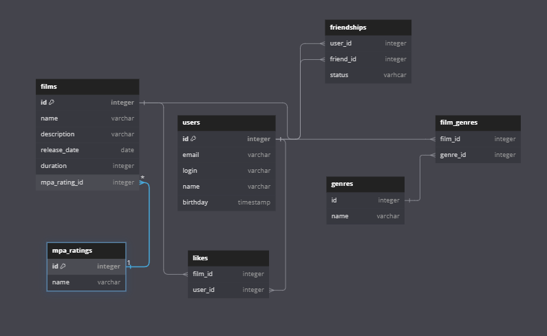

```
Table films {
  id integer [primary key]
  name varchar
  description varchar
  release_date date
  duration integer
  mpa_rating_id integer
}

Table users {
  id integer [primary key]
  email varchar
  login varchar
  name varchar
  birthday timestamp
}

Table mpa_ratings {
  id integer [primary key]
  name varchar
}

Table likes {
  film_id integer
  user_id integer
}

Table genres {
  id integer
  name varchar
}

Table friendships {
  user_id integer
  friend_id integer
  status varhcar
}

Table film_genres {
  film_id integer
  genre_id integer
}

ref: films.mpa_rating_id > mpa_ratings.id
ref: film_genres.film_id > films.id
ref: film_genres.genre_id > genres.id
ref: likes.film_id > films.id
ref: likes.user_id > users.id
ref: friendships.user_id >  users.id
ref: friendships.friend_id > users.id
```